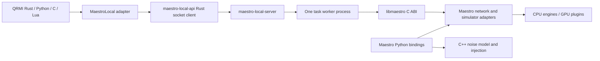

# Exposing Maestro capabilities through QRMI

> This report records the pre-implementation source analysis. The approved changes and validation results are now recorded in [the implementation plan](maestro-implementation-plan.md); usage is documented in [the native API guide](maestro-native-api.md). Source line references below describe the original snapshot.

Analysis date: 2026-09-16. This is an implementation proposal based on source inspection, not a record of implemented or tested changes.

The review covers the QRMI interfaces and other vendor implementations, its Maestro socket client, the local server and worker, Maestro's C ABI, Python bindings, simulator adapters, noise code, and relevant existing tests. No builds, simulations, daemon requests, deployments, or implementation changes were performed for this report.

**Implementation constraint: no Python in the server execution architecture.** The daemon and all task/MPI workers must remain native Rust/C/C++. This proposal includes neither Python embedding nor Python worker subprocesses. Python bindings are inspected as an API reference; Python client applications remain separate from the server.

| Repository | Inspected revision | Initial working tree |
| --- | --- | --- |
| `/home/adrian/slurm/qrmi` | `47d69976ab2329c377770a22ce547ce702ef21cb` | Clean |
| `/home/adrian/slurm/maestro-local-server` | `84d597e4f7ee8ffc4831c42f693b6b55d55a2aa7` | Clean |
| `/home/adrian/maestro` | `f88067950d39e254ad025452fa48c44d84d792b4` | Existing modified `build.sh` and untracked `validation_scratch/`; left untouched |

Source links below are pinned to these inspected revisions on GitHub. Claims about existing behavior come from code; proposed interfaces and implementation phases are explicitly identified as proposals. GPU plugin implementations and the surrounding Slurm integration were not independently audited.

## 1. Assessment

**Most of Maestro's computational functionality can be exposed through QRMI without expanding the `QuantumResource` trait.** QRMI already accommodates vendor-specific task payloads, serialized results, target descriptions, logs, and acquisition/session lifecycles. It does not inherently restrict a resource to sampling and expectation values.

The main limitations are the narrow Maestro C entry points used by the server, the server's two-operation task model, and missing configuration/capability contracts. QRMI's existing Maestro payload already carries arbitrary JSON configuration, but the native execution path reads only a few keys. Adding more JSON keys at the QRMI end alone will usually have no effect.

The most practical direction is:

1. Share configuration, validation, noise, and execution logic inside Maestro between the C ABI and Python bindings.
2. Extend the local server's request/result contract while retaining its cancellable worker processes.
3. Keep QRMI as the resource/task interface, with Maestro-specific configuration helpers and capability discovery.
4. Implement local multi-GPU execution separately from MPI execution. They have substantially different launch and lifecycle requirements.

**Noise and local multi-GPU execution are achievable largely by exposing existing engine code. MPI needs additional orchestration.** Exact distributed density-matrix/MPO simulation is a different matter: the current distributed GPU backends support statevectors only. Supporting those distributed mixed-state methods would require engine/plugin work, beyond these adapters.

“All functionality” should mean all supported computational operations and configuration, with backend-specific constraints. Reproducing every in-process C++ object, Python helper, callback, or MPI handle as a remote object is a much larger API project and is unnecessary for most workloads.

## 2. The existing path and what QRMI permits

There are two distinct libraries in the current chain:



The Rust library under QRMI is a **socket client**, not the native simulator library. The server links `libmaestro` and uses its C ABI. Maestro's Python execution helpers access C++ objects directly, so they expose functionality that never passes through `SimpleExecute` or `SimpleEstimate`. This explains the divergence. See [QRMI adapter](https://github.com/QoroQuantum/qrmi/blob/47d69976ab2329c377770a22ce547ce702ef21cb/src/maestro/local.rs#L181), [socket client](https://github.com/QoroQuantum/qrmi/blob/47d69976ab2329c377770a22ce547ce702ef21cb/dependencies/maestro_rust_library/src/lib.rs#L28), [server execution](https://github.com/QoroQuantum/maestro-local-server/blob/84d597e4f7ee8ffc4831c42f693b6b55d55a2aa7/src/maestro/runner.rs#L57), and [Python configuration](https://github.com/QoroQuantum/maestro/blob/f88067950d39e254ad025452fa48c44d84d792b4/python/bindings.cpp#L160).

### Lessons from other QRMI implementations

| Existing implementation | Relevant behavior | Implication for Maestro |
| --- | --- | --- |
| IBM Quantum Compute Service | Dispatches `sampler`, `estimator`, and `noiselearner` program IDs with vendor-specific JSON models. | More than two operation types fit the existing task API. IBM noise learning is not a ready-made Maestro noise-simulation implementation. |
| IQM Server | Submits vendor JSON with a `job_type`; returns architecture, calibration, and quality data through `target()`. | Maestro can expose a richer operation document and capability description without standardizing all fields across vendors. |
| Pasqal Local | Uses sessions, task logs, serialized results, and device specifications through the same trait. | Maestro's missing logs and target discovery can use interfaces that already exist. |
| Pasqal Cloud | Routes Pulser and CUDA-Q requests through the same payload variant based on the serialized input. | A richer input format need not force a new resource type. |
| Alice & Bob Felis | Accepts QIR plus JSON parameters. | QRMI does not prescribe a single circuit format or configuration model. |

Sources: [IBM dispatch](https://github.com/QoroQuantum/qrmi/blob/47d69976ab2329c377770a22ce547ce702ef21cb/src/ibm/quantum_compute_service.rs#L265), [IQM submission](https://github.com/QoroQuantum/qrmi/blob/47d69976ab2329c377770a22ce547ce702ef21cb/src/iqm/server.rs#L128), [IQM target](https://github.com/QoroQuantum/qrmi/blob/47d69976ab2329c377770a22ce547ce702ef21cb/src/iqm/server.rs#L308), [Pasqal Local](https://github.com/QoroQuantum/qrmi/blob/47d69976ab2329c377770a22ce547ce702ef21cb/src/pasqal/local.rs#L98), [Pasqal Cloud](https://github.com/QoroQuantum/qrmi/blob/47d69976ab2329c377770a22ce547ce702ef21cb/src/pasqal/cloud.rs#L231), [Felis](https://github.com/QoroQuantum/qrmi/blob/47d69976ab2329c377770a22ce547ce702ef21cb/src/alice_bob/felis.rs#L120).

The important extension points are already present:

- `Payload::MaestroLocal` contains `input`, `job_type`, integer simulator/method selections, `observables`, and a JSON `config` string.
- `TaskResult.value` and `Target.value` are strings containing vendor-specific serialized data.
- `task_logs()` can report native diagnostics; `metadata()` is a string map suitable for compact resource information.
- `ResourceProvider` can optionally enumerate resources. Maestro currently uses static resource definitions; dynamic discovery is implemented only for IBM resource types in the provider factory.

Sources: [payload](https://github.com/QoroQuantum/qrmi/blob/47d69976ab2329c377770a22ce547ce702ef21cb/src/models/payload.rs#L42), [result](https://github.com/QoroQuantum/qrmi/blob/47d69976ab2329c377770a22ce547ce702ef21cb/src/models/task_result.rs#L26), [target](https://github.com/QoroQuantum/qrmi/blob/47d69976ab2329c377770a22ce547ce702ef21cb/src/models/target.rs#L26), [trait](https://github.com/QoroQuantum/qrmi/blob/47d69976ab2329c377770a22ce547ce702ef21cb/src/lib.rs#L314), [provider factory](https://github.com/QoroQuantum/qrmi/blob/47d69976ab2329c377770a22ce547ce702ef21cb/src/resource_provider.rs#L100).

### What the Maestro path actually does today

QRMI accepts only `execute` and `estimate`. It checks basic input and JSON shape, creates a server task, sends its fields through separate commands, then starts it. `execute` returns measurement counts for the requested shots; there is no separate QRMI sampling operation. `estimate` returns Pauli expectation values; `shots` is not used by the native estimator. Logs and target discovery are unsupported, and metadata contains only the backend name. See [submission and validation](https://github.com/QoroQuantum/qrmi/blob/47d69976ab2329c377770a22ce547ce702ef21cb/src/maestro/local.rs#L195), [metadata](https://github.com/QoroQuantum/qrmi/blob/47d69976ab2329c377770a22ce547ce702ef21cb/src/maestro/local.rs#L351), and [native estimator](https://github.com/QoroQuantum/maestro/blob/f88067950d39e254ad025452fa48c44d84d792b4/maestrolib/Interface.cpp#L334).

Despite the client's QASM-oriented naming, the native calls also accept a limited JSON circuit format: a gate/measurement array, or an object containing a `qasm`/`QASM` string. This is not a complete serialized circuit/noise format; in particular, the object parser does not implement the broader `instructions` object illustrated in an old comment in `Interface.cpp`. A new request schema should explicitly identify its circuit format instead of extending that ambiguous convention. See [actual JSON parser](https://github.com/QoroQuantum/maestro/blob/f88067950d39e254ad025452fa48c44d84d792b4/maestrolib/Json.h#L46).

The server stores the options string and forwards it to the native library. It does not enforce a fixed list of configuration keys. The effective filtering happens in `SimpleExecute`/`SimpleEstimate`, which recognize:

| Configuration key | Current native behavior |
| --- | --- |
| `shots` | Execution only; defaults to 1. |
| `gpu_device` | Passed to the network configuration. |
| `matrix_product_state_max_bond_dimension` | Passed to the network configuration. |
| `matrix_product_state_truncation_threshold` | Passed to the network configuration, with a numeric formatting problem described below. |
| `matrix_product_state_truncation_mode` | Passed to the network configuration. |
| `mps_sample_measure_algorithm` | Passed to the network configuration. |
| Other keys, including noise, precision, seeds, and distribution settings | Not interpreted by these entry points. |

Sources: [execute options](https://github.com/QoroQuantum/maestro/blob/f88067950d39e254ad025452fa48c44d84d792b4/maestrolib/Interface.cpp#L152), [estimate options](https://github.com/QoroQuantum/maestro/blob/f88067950d39e254ad025452fa48c44d84d792b4/maestrolib/Interface.cpp#L354). The Rust client's convenience `TaskConfig` is narrower still, containing shots and three MPS settings, although QRMI itself uses the raw JSON setter and therefore bypasses that convenience type: [TaskConfig](https://github.com/QoroQuantum/qrmi/blob/47d69976ab2329c377770a22ce547ce702ef21cb/dependencies/maestro_rust_library/src/maestro/session.rs#L110).

The newer server already provides useful infrastructure: each task executes in a fresh process, private IPC is length-prefixed JSON, and cancellation terminates and reaps a local worker process group. Jobs still run one at a time. A session is bookkeeping around jobs, not a persistent simulator or a reservation of particular GPUs. See [worker](https://github.com/QoroQuantum/maestro-local-server/blob/84d597e4f7ee8ffc4831c42f693b6b55d55a2aa7/src/maestro/worker.rs#L161), [private protocol](https://github.com/QoroQuantum/maestro-local-server/blob/84d597e4f7ee8ffc4831c42f693b6b55d55a2aa7/src/maestro/worker/protocol.rs#L1), and [runner](https://github.com/QoroQuantum/maestro-local-server/blob/84d597e4f7ee8ffc4831c42f693b6b55d55a2aa7/src/maestro/runner.rs#L129).

## 3. Capability inventory and feasibility

“Available in Maestro” below means implemented/exposed in the inspected source, subject to the selected backend and installed dependencies. It does not assert that every combination is supported or that the installed server library matches this checkout.

| Capability | Maestro surface | Current QRMI/server coverage | Feasible exposure |
| --- | --- | --- | --- |
| Circuit execution, counts, Pauli expectations | C ABI and Python | Present, with limited options. | Retain and extend. |
| Additional CPU/GPU methods, including density matrix and MPO | Factory and Python enums | Integer fields can already select newer methods; no useful discovery or compatibility validation. | Mostly configuration, validation, and accurate result metadata. |
| Full simulator tuning | Python `SimulatorConfig`, network setters, backend `Configure` methods | Small whitelist only. | Shared configuration model and C ABI dispatch. |
| Noise simulation | C++ `NoiseModel`, injection functions, `NoiseAdd`, Python execution helpers | No noise model or execution dispatch. | Reuse C++ code and serialize the model. |
| Local distributed GPU statevector | C++ adapter and Python `DistributedGpu` | No distribution configuration; native simple path lacks the explicit distributed setup used by Python. | Extend native setup and configuration; retain one worker per task. |
| MPI distributed GPU statevector | C++ adapter and Python `DistributedMpiGpu` | No MPI initialization, collective request execution, or launcher. | New MPI worker/launcher orchestration plus native ABI additions. |
| Statevector export, all/selected probabilities and amplitudes | Python helpers; some low-level C ABI queries | No task/result operations. | New task operations, backend checks, complex-number encoding, output limits. |
| Single-state path-integral probability | Python `state_probability`, circuit `prob` | Not exposed. | Native operation with target bitstring and threshold. |
| Mirror fidelity and circuit overlap | Python helpers and network operations | Not exposed. | New tasks; shared helper extraction and unitary-circuit validation. |
| Noisy fidelity | Python circuit helper | Not exposed. | Possible, but current helper needs semantic restrictions/fixes before broad exposure. |
| Incremental evolution with intermediate expectations | Python `incremental_evolve` | Not exposed. | One task containing initial circuit, step circuit, observation steps, and observables. State can stay inside one worker. |
| Prefix checkpoint reuse | Python `PrefixCheckpointedSimulator`; native save/restore | No reusable simulator across tasks. | Batch suffixes in one task first; persistent workers only if reuse across separate submissions is needed. |
| Mixed-state diagnostics and MPO maintenance | Native simulator API and Python `Simulator` | No C task API or serialized outputs. | Add post-execution queries/actions on the live worker state. |
| Parameter binding, input discovery, parser diagnostics | QASM parser and Python `QasmToCirc` | Parsing exists, but no parameter map or detailed parse errors in simple C calls. | Add bindings and optional parse/validate tasks. |
| Low-level state initialization, gates, reset, measurement, snapshots | C++ simulator API; substantial subset in C ABI | Server wrapper uses only simple execute/estimate. | Declarative task programs or explicit session-state API. |
| Automatic backend selection/candidate lists and optimization controls | Network layer; C ABI can add optimization candidates | Server always supplies one candidate. | Expose as an explicit selection mode, subject to estimator/build availability. |
| Stim/Sinter workflows and detector sampling | Python `maestro.sinter` | Not exposed. | Client-side integration over native measurement tasks, or a separate native port; requires measurement-record and decoder contracts. |
| Quantum-network topology, host execution, scheduler facilities | C++ network/scheduler APIs, some conditional Composer integration | A simple single-host network only. | Separate, larger task schema and native API work. Not the same feature as GPU state distribution. |

The Python computational inventory is visible in [bindings](https://github.com/QoroQuantum/maestro/blob/f88067950d39e254ad025452fa48c44d84d792b4/python/bindings.cpp#L1517), [additional operations](https://github.com/QoroQuantum/maestro/blob/f88067950d39e254ad025452fa48c44d84d792b4/python/bindings.cpp#L2178), [diagnostics](https://github.com/QoroQuantum/maestro/blob/f88067950d39e254ad025452fa48c44d84d792b4/python/bindings.cpp#L1280), [incremental evolution](https://github.com/QoroQuantum/maestro/blob/f88067950d39e254ad025452fa48c44d84d792b4/python/bindings.cpp#L824), and [checkpointing](https://github.com/QoroQuantum/maestro/blob/f88067950d39e254ad025452fa48c44d84d792b4/python/bindings.cpp#L942). Lower-level state/channel operations are in [State.h](https://github.com/QoroQuantum/maestro/blob/f88067950d39e254ad025452fa48c44d84d792b4/Simulators/State.h#L162). Sinter is a separate [Python module](https://github.com/QoroQuantum/maestro/blob/f88067950d39e254ad025452fa48c44d84d792b4/maestro/sinter.py#L594). Native network construction is in [Maestro.h](https://github.com/QoroQuantum/maestro/blob/f88067950d39e254ad025452fa48c44d84d792b4/maestrolib/Maestro.h#L27).

### Backend selection must become a stable contract

The factory currently accepts the following method families:

| Backend | Methods accepted by the main factory |
| --- | --- |
| QCSim | Statevector, MPS, stabilizer, tensor network, Pauli propagator, extended stabilizer, path integral, density matrix, MPO. |
| Qiskit Aer, when compiled in | Statevector, MPS, stabilizer, tensor network, extended stabilizer, density matrix; actual availability depends on the Aer build. |
| Composite QCSim / Composite Aer | Treat as statevector-only in the public contract, matching Python validation. |
| Ordinary GPU | Statevector, MPS, tensor network, Pauli propagator, density matrix, MPO, subject to plugin entry points and hardware. |
| QuEST | Statevector, subject to plugin availability. |
| Distributed GPU / Distributed MPI GPU | Statevector only. |

Sources: [factory](https://github.com/QoroQuantum/maestro/blob/f88067950d39e254ad025452fa48c44d84d792b4/Simulators/Factory.cpp#L173), [GPU factory branch](https://github.com/QoroQuantum/maestro/blob/f88067950d39e254ad025452fa48c44d84d792b4/Simulators/Factory.cpp#L237), [Python combination validation](https://github.com/QoroQuantum/maestro/blob/f88067950d39e254ad025452fa48c44d84d792b4/python/bindings.cpp#L160). A `GpuStabilizer` class exists, but the main `Gpu` factory branch does not select stabilizer; its presence is insufficient to advertise that combination.

The numeric simulator IDs are conditional on `NO_QISKIT_AER`:

| Backend | Aer-enabled enum | Aer-disabled enum |
| --- | --- | --- |
| Aer | 0 | Absent |
| QCSim | 1 | 0 |
| Composite Aer | 2 | Absent |
| Composite QCSim | 3 | 1 |
| GPU | 4 | 2 |
| QuEST | 5 | 3 |
| Distributed GPU | 6 | 4 |
| Distributed MPI GPU | 7 | 5 |

This follows directly from the [conditional enum](https://github.com/QoroQuantum/maestro/blob/f88067950d39e254ad025452fa48c44d84d792b4/Simulators/State.h#L72). Existing QRMI examples hardcode IDs, for example [Aer as 0](https://github.com/QoroQuantum/qrmi/blob/47d69976ab2329c377770a22ce547ce702ef21cb/examples/qiskit_primitives/maestro_local/estimator.py#L73). Stable symbolic backend/method names should be the new wire contract. Translate names into native enums inside the library built with those enums. Retain legacy numeric requests with a documented build-specific interpretation; never assume a Python installation and server library share the same enum layout.

### Configuration coverage

The following groups should be exposed with backend applicability and value validation. Passing arbitrary strings to `Configure` is insufficient: several backends retain unknown settings without applying them.

| Group | Settings to cover | Required handling |
| --- | --- | --- |
| Execution and reproducibility | Shots, simulator seed, separate noise seed and realization count | Distinguish sampling randomness from noise generation; preserve full integer range. |
| Precision and device | `gpu_device`, `use_double_precision`, Aer/distributed `precision` | Normalize Python's boolean precision field to native `single`/`double`; validate by backend. |
| MPS/MPO truncation | Bond limit, threshold, truncation mode, MPS sampling algorithm | Support both documented aliases and backend constraints; preserve tiny floating-point values. |
| MPS optimization | `disable_optimized_swapping`, `lookahead_depth` | These call network setters in Python, rather than just configuring a simulator key. |
| MPO channels and maintenance | Kraus completeness mode, restore-trace and hermitize-after-truncation flags | Advertise only where implemented; GPU does not currently consume the two automatic maintenance flags in its `Configure` implementation. |
| GPU SVD | MPS/MPO/TN `gesvd`, `gesvdj`, `gesvdp`, `gesvdr` choices | Map Python aliases to native keys such as `matrix_product_state_use_gesvdj`; reject conflicting selections. |
| Pauli propagation | Coefficient and Pauli-weight thresholds, trim cadence, deduplication cadence | Wire all four; thresholds alone do not establish a truncation cadence. |
| Path integral | `path_integral_threshold` | Preserve numeric precision; validate operation support. |
| Distribution | Device group, global qubits, backend/layout flags, queue/workspace, snapshot storage, host indexing, MPI peer grouping | Configure before state creation; keep launcher settings separate. |
| Parallelism and selection | `max_simulators`, threading/backend-specific controls, fixed versus automatic selection, candidate list | Respect the worker allocation and backend capabilities; this group extends beyond Python's current config fields. |

Sources: [config fields](https://github.com/QoroQuantum/maestro/blob/f88067950d39e254ad025452fa48c44d84d792b4/python/bindings.cpp#L44), [config application](https://github.com/QoroQuantum/maestro/blob/f88067950d39e254ad025452fa48c44d84d792b4/python/bindings.cpp#L193), [QCSim options](https://github.com/QoroQuantum/maestro/blob/f88067950d39e254ad025452fa48c44d84d792b4/Simulators/QCSimState.h#L654), [GPU options](https://github.com/QoroQuantum/maestro/blob/f88067950d39e254ad025452fa48c44d84d792b4/Simulators/GpuState.h#L655), [Aer options](https://github.com/QoroQuantum/maestro/blob/f88067950d39e254ad025452fa48c44d84d792b4/Simulators/AerState.h#L202), [network configuration](https://github.com/QoroQuantum/maestro/blob/f88067950d39e254ad025452fa48c44d84d792b4/Network/SimpleDisconnectedNetwork.h#L1061). For example, Aer rejects `relative_max` truncation; exposing one common field does not imply identical backend support.

## 4. Noise simulation

### Reusable implementation already exists

`python/noise.h` contains ordinary C++ code, with no nanobind dependency. It implements the noise model and circuit transformations. `Noise/NoiseAdd.h` already wraps these transformations with native execution/estimation loops. Therefore **embedding Python is not necessary to expose noise through the Rust server**. The main work is model serialization, shared configuration and dispatch, correct result semantics, and validation. See [noise model](https://github.com/QoroQuantum/maestro/blob/f88067950d39e254ad025452fa48c44d84d792b4/python/noise.h#L56) and [native noise helper](https://github.com/QoroQuantum/maestro/blob/f88067950d39e254ad025452fa48c44d84d792b4/Noise/NoiseAdd.h#L21).

A maintainable change would move the reusable model to a normal core location and have Python and the C ABI call the same implementation. The existing native helper is a starting point, not a completely validated replacement for all Python paths; specific issues are listed in section 8.

The model already covers:

- Per-qubit Pauli channels, depolarization, dephasing, and bit flips; additional one-/two-qubit-gate noise and pair depolarization.
- Coherent rotations and strength controls; crosstalk modeled by spectator rotations.
- T1 damping, phase damping, T1/T2 thermal relaxation with separate two-qubit gate durations, and finite-temperature generalized amplitude damping.
- Correlated phase flips and arbitrary one-/two-qubit Kraus channels.
- AR(1)/OU time-correlated noise, multiple OU bands, and synthesized 1/f noise.
- Idle noise on delay operations, including relaxation, detuning, and correlated dephasing.
- Symmetric/asymmetric classical readout errors.

The bound builder methods are in [bindings](https://github.com/QoroQuantum/maestro/blob/f88067950d39e254ad025452fa48c44d84d792b4/python/bindings.cpp#L2465). The actual crosstalk implementation applies Rz rotations to spectators, so the API should describe that implemented model rather than imply a general Hamiltonian crosstalk simulator: [injection](https://github.com/QoroQuantum/maestro/blob/f88067950d39e254ad025452fa48c44d84d792b4/python/noise.h#L1945).

### Preserve the distinction between algorithms

| Execution mode | Existing behavior | Proposed QRMI contract |
| --- | --- | --- |
| Analytical `noisy_estimate` | Applies one terminal Pauli damping factor to ideal expectations. It does not model noise after every gate or most other noise layers. | Explicitly named approximation; reject incompatible layers or report the omitted layers. Never select it silently for an arbitrary noise model. |
| `noisy_execute` / `noisy_estimate_montecarlo` | Uses exact Markovian channels on supported density-matrix/MPO configurations, otherwise sampled circuit rewrites. | Return the actual channel/trajectory method, realization count, and seeds. |
| `coherent_execute` / `coherent_estimate` | Coherent-error realizations. | Separate scope from combined noise. |
| `full_noise_execute` / `full_noise_estimate` | Combines configured layers; mixed-state methods handle eligible Markovian channels exactly while time-correlated/coherent realizations remain an outer sampling concern. | Recommended general noise operation, with an explicit backend/model compatibility check. |
| Circuit `noisy_prob` | First-order readout correction around a path-integral probability query. | Expose as an approximation with a narrow readout scope, not general noisy probability evaluation. |

Sources: [exact-channel routing and noise seeds](https://github.com/QoroQuantum/maestro/blob/f88067950d39e254ad025452fa48c44d84d792b4/python/bindings.cpp#L374), [analytical estimator limitation](https://github.com/QoroQuantum/maestro/blob/f88067950d39e254ad025452fa48c44d84d792b4/python/bindings.cpp#L2890), [execution batching](https://github.com/QoroQuantum/maestro/blob/f88067950d39e254ad025452fa48c44d84d792b4/python/bindings.cpp#L2960), [combined execution](https://github.com/QoroQuantum/maestro/blob/f88067950d39e254ad025452fa48c44d84d792b4/python/bindings.cpp#L3141), [readout approximation](https://github.com/QoroQuantum/maestro/blob/f88067950d39e254ad025452fa48c44d84d792b4/python/bindings.cpp#L1653).

There are material limitations to preserve or improve:

1. **Exact channel evolution is backend-specific.** The current Python dispatcher uses QCSim density matrix/MPO, Aer density matrix, and ordinary GPU density matrix/MPO. Distributed GPU backends are not in this set.
2. **The current sampled T1 implementation is an approximation.** A stochastic reset reproduces populations but damps coherences differently from exact amplitude damping. A general exact Kraus-trajectory engine for pure states would be an additional Maestro feature, not just exposure work. See [sampled T1](https://github.com/QoroQuantum/maestro/blob/f88067950d39e254ad025452fa48c44d84d792b4/python/noise.h#L1496).
3. **Thermal relaxation has a narrower sampled domain.** The model enforces physical parameters, rejects T1/thermal double counting, and requires a density-matrix/MPO backend for the current unsupported sampled regime `T2 > T1`. Generalized amplitude damping, the configured correlated phase-flip channel, and arbitrary Kraus maps also require the exact-channel path in the current implementation. These are implementation restrictions, not claims that no alternative stochastic algorithm could exist. See [capability predicates](https://github.com/QoroQuantum/maestro/blob/f88067950d39e254ad025452fa48c44d84d792b4/python/noise.h#L1012) and [injection checks](https://github.com/QoroQuantum/maestro/blob/f88067950d39e254ad025452fa48c44d84d792b4/python/noise.h#L1428).
4. **Shots and noise realizations differ.** Several shots may share one sampled noisy circuit. The output should record that batching, and statistical uncertainty should account for it. Existing noisy estimators return averages without general error bars; adding uncertainty estimates is extra functionality.
5. **Readout is currently a postprocessing step on counts.** Ideal-state expectation values do not automatically include readout error. The shared implementation also needs an explicit qubit-to-classical-bit mapping for nontrivial measurement layouts; current helpers index a bitstring position as a qubit ID. See [readout helper](https://github.com/QoroQuantum/maestro/blob/f88067950d39e254ad025452fa48c44d84d792b4/Noise/NoiseAdd.h#L67).
6. **“Exact channels” do not eliminate all approximation.** MPO truncation and finite sampling of stochastic layers remain relevant and should appear in result metadata.

A declarative JSON noise model should describe channels and parameters, including units and target qubits. It should not serialize Python objects or arbitrary method calls. For Kraus matrices, specify complex-number encoding, matrix layout, and target order: Maestro's Python API states that `targets[0]` is the least significant matrix bit. Reuse existing validation in `NoiseModel` and `QuantumChannel`. See [Kraus interface](https://github.com/QoroQuantum/maestro/blob/f88067950d39e254ad025452fa48c44d84d792b4/python/bindings.cpp#L2670).

## 5. GPU distribution

### Local multi-GPU execution

This is the most direct distributed feature to expose. The `DistributedGpu` backend already distributes a statevector across GPUs within one process. One existing worker can own that process and its device group; the daemon does not need to launch one worker per GPU.

The native simple path must explicitly create the distributed backend **before circuit mapping**, as Python does. Merely placing a distributed backend in the optimization candidate set is not equivalent. The current C ABI initially calls `network->CreateSimulator()` with default arguments; the distribution-aware mapping and execution branches inspect the already-created simulator. A simple circuit might reach a distributed candidate later, but that does not provide the complete distributed contract for idle wires, configured placement, or repeated measurement. Sources: [C initialization](https://github.com/QoroQuantum/maestro/blob/f88067950d39e254ad025452fa48c44d84d792b4/maestrolib/Interface.cpp#L217), [Python distributed initialization](https://github.com/QoroQuantum/maestro/blob/f88067950d39e254ad025452fa48c44d84d792b4/python/bindings.cpp#L309), [distribution-aware mapping](https://github.com/QoroQuantum/maestro/blob/f88067950d39e254ad025452fa48c44d84d792b4/Network/SimpleDisconnectedNetwork.h#L776).

Settings to carry include `distributed_devices`, `distributed_global_qubits`, `distributed_backend`, `distributed_flags`, `distributed_max_queued_gates`, `distributed_transfer_workspace_bytes`, `distributed_snapshot_storage`, `distributed_host_qubit_indexing`, precision, and seed. Apply allocation settings before initialization and report resolved placement afterward. See [distributed configuration implementation](https://github.com/QoroQuantum/maestro/blob/f88067950d39e254ad025452fa48c44d84d792b4/Simulators/DistributedGpuState.h#L30).

The current documented limits/defaults include power-of-two shard groups, at most 32 shards, fewer than 63 total qubits, and at least one local qubit; practical capacity is limited by GPU memory. Automatic local selection uses visible GPUs. An explicit `gpu_device` without a device list selects one GPU rather than a multi-GPU group. These rules should be discoverable instead of duplicated as assumptions in clients. See [distributed GPU contract](https://github.com/QoroQuantum/maestro/blob/f88067950d39e254ad025452fa48c44d84d792b4/docs/distributed_gpu.md).

The worker inherits the daemon's environment, **not the submitting QRMI process's Slurm/GPU environment**. Setting `CUDA_VISIBLE_DEVICES` in a QRMI client therefore does not automatically constrain the existing daemon's worker. Deployment must either run the service within the intended allocation or resolve the resource/allocation to a permitted device set and launch environment on the server. A backend name currently does not perform this mapping.

### MPI and multiple nodes

Passing `simulator_type=DistributedMpiGpu` and MPI-looking options to the current server is insufficient. Maestro expects the application to initialize MPI and run matching simulator calls on all ranks. It does not supply a rank-zero dispatcher or initialize application MPI. Raw MPI communicator handles from a client process cannot be transported to an unrelated server worker and reused there. See [MPI lifecycle contract](https://github.com/QoroQuantum/maestro/blob/f88067950d39e254ad025452fa48c44d84d792b4/docs/distributed_gpu.md) and [runtime wrapper](https://github.com/QoroQuantum/maestro/blob/f88067950d39e254ad025452fa48c44d84d792b4/Simulators/DistributedMpiGpuLibrary.h#L15).

A proposed server-controlled MPI task would have this lifecycle:

1. Resolve an allocation and launch profile, then start one MPI worker group using the site's launcher (`srun`, `mpirun`, or an equivalent managed mechanism).
2. Initialize MPI in every worker rank with an appropriate thread level; create or select the communicator inside that group.
3. Deliver one validated request to the group, normally through a rank-zero ingress and a broadcast. Execute the same logical operations, observation calls, and state lifecycle on every rank.
4. Use matching simulation/noise seeds. Maestro's normal MPI noise helpers deliberately default to a common seed; rank-independent random noisy circuits would violate the collective contract.
5. Emit one external result from rank zero. Ordinary Maestro outputs are replicated across ranks, so summing those counts would multiply the number of shots incorrectly.
6. Destroy all states/networks collectively, finalize Maestro's MPI backend, and then finalize application MPI.
7. On cancellation or rank failure, terminate the complete launcher/job step and ensure remote ranks are gone before acknowledging completion of cancellation.

The existing local process-group cancellation is useful but does not guarantee remote-rank cleanup. Nor can the current private worker socket simply be inherited by every launched rank: it is a single local socket pair on stdin, and launchers handle stdin differently. An MPI worker needs an explicit ingress/result mechanism and collective error handling. Sources: [worker transport](https://github.com/QoroQuantum/maestro-local-server/blob/84d597e4f7ee8ffc4831c42f693b6b55d55a2aa7/src/maestro/worker.rs#L169), [cancellation implementation](https://github.com/QoroQuantum/maestro-local-server/blob/84d597e4f7ee8ffc4831c42f693b6b55d55a2aa7/src/maestro/worker.rs#L117), [documented cancellation scope](https://github.com/QoroQuantum/maestro-local-server/blob/84d597e4f7ee8ffc4831c42f693b6b55d55a2aa7/docs/worker-process.md).

A small C++ MPI worker linked to Maestro and MPI is one practical design; a Rust worker using an MPI binding is another. Keeping the MPI launcher/worker separate permits ordinary Maestro and the daemon to retain their current MPI-independent library build. The C ABI should expose explicit backend shutdown and collective execution support, or the C++ worker can initially call those C++ interfaces directly.

**Noise and distributed statevectors can be combined where the noise has a supported sampled realization.** Exact density-matrix/MPO channels cannot be enabled on the current distributed backends by configuration. Optional parallelization of independent noise trajectories across separate GPU groups is yet another feature: it differs from distributing one statevector and needs separate seed/aggregation rules.

The repository records successful local/two-GPU and two-rank validation, but explicitly says physical cross-machine MPI was not tested. That is historical evidence in the repository, not validation performed for this report: [distributed validation record](https://github.com/QoroQuantum/maestro/blob/f88067950d39e254ad025452fa48c44d84d792b4/docs/distributed_gpu_validation.md#L1).

## 6. Proposed architecture and changes by project

### Maestro: make the native library the common implementation

The preferred design is a shared native request/execution layer called by both the C ABI and the Python extension. It must use C++ data structures and ordinary errors internally, with C-compatible buffers/status codes at the ABI boundary. The Rust server must have no dependency on the Python extension, interpreter, Python exception classes, or `nb::dict` result builders.

The build already separates `libmaestro` from the optional nanobind extension. A native server deployment can build Maestro with `BUILD_PYTHON_BINDINGS=OFF`; preserve that separation when extracting helpers, including removal of binding-specific GIL handling and exception construction from the shared code. This is a proposed packaging check, not a build performed during this review. See [optional Python target](https://github.com/QoroQuantum/maestro/blob/f88067950d39e254ad025452fa48c44d84d792b4/CMakeLists.txt#L379).

| Area | Proposed change | Why it is needed |
| --- | --- | --- |
| Configuration | Extract a shared simulator/execution configuration model and application routine from `python/bindings.cpp`; add backend-aware validation and effective-setting reporting. | Prevents separate Python/C option lists from diverging again. Include the network setters as well as simulator keys. |
| Request parsing | Add a versioned JSON request parser covering operation, circuits, input bindings, observables, configuration, noise, and requested outputs. | Provides one native contract that the server can call without duplicating quantum logic in Rust. |
| Backend construction | Resolve stable names internally; create fixed/distributed backends explicitly; make automatic selection a separate mode. | Prevents silent fallback and ensures distribution configuration precedes mapping/allocation. |
| Noise | Expose the existing C++ model/injection/execution code; unify `NoiseAdd` and binding execution paths where appropriate. | Enables noise with no Python runtime and one source of numerical semantics. |
| Additional operations | Extract statevector, probability, overlap, mirror, evolution, and checkpoint helpers into reusable native functions. | Their current high-level implementations are largely inside the binding translation unit. |
| Diagnostics | Add requested mixed-state queries and MPO maintenance actions before the worker destroys its state. | The current simple calls discard state before a subsequent request could inspect it. |
| C ABI | Add versioned request/capability entry points, explicit buffer ownership, structured failures, and MPI backend shutdown where needed. | Current simple functions and low-level pointer API are insufficient as a robust service boundary. |
| Build/package | Include shared execution sources in `libmaestro`; install a matching API header and expose build/API versions. | The core target currently builds principally `Interface.cpp` and `Factory.cpp`, separately from the Python binding source. |

Sources for the affected boundaries: [C header](https://github.com/QoroQuantum/maestro/blob/f88067950d39e254ad025452fa48c44d84d792b4/maestrolib/Interface.h#L15), [low-level configuration ABI](https://github.com/QoroQuantum/maestro/blob/f88067950d39e254ad025452fa48c44d84d792b4/maestrolib/Interface.cpp#L906), [library target](https://github.com/QoroQuantum/maestro/blob/f88067950d39e254ad025452fa48c44d84d792b4/CMakeLists.txt#L302), [binding execution helpers](https://github.com/QoroQuantum/maestro/blob/f88067950d39e254ad025452fa48c44d84d792b4/python/bindings.cpp#L432).

Illustrative entry points could be `MaestroRunRequestJson`, `MaestroGetCapabilitiesJson`, and `MaestroFreeBuffer`; these names are proposals, not existing functions. A synchronous native call is sufficient because the server already supplies asynchronous task management and process-level cancellation. Catch C++ exceptions inside every new exported C entry point and return structured failures; do not allow them to cross into Rust.

Keep `SimpleExecute`/`SimpleEstimate` available for old clients. They can become compatibility wrappers around the new core while retaining their historical input/output contract. Avoid adding more independently implemented `Simple*` functions for every Python operation.

A generic `ConfigureSimpleSimulator` C function could enable a smaller first patch for options, but it would not by itself expose noise, shared validation, complex result types, parser bindings, or explicit distributed construction. Likewise, the existing `ConfigureSimulator(void*)` configures a separately created low-level simulator, not the simple network currently owned by the server's wrapper.

### Local server: transport, scheduling, and native execution

| File/area | Proposed work |
| --- | --- |
| `src/main.rs` | Add public API-version/capability discovery and a versioned, lossless request transport. Retain legacy commands. Separate ordinary and MPI worker dispatch. |
| `src/maestro/sessions.rs` | Accept an atomic validated task document instead of requiring many mutating setters for new requests. Support operation-specific validation, configurable session lifetime/keepalive, and richer task records. |
| `src/maestro/runner.rs` | Carry the new request type; dispatch native CPU/GPU or MPI execution; retain detailed failure information and resource placement. One-at-a-time scheduling can remain initially. |
| `src/maestro/simulators.rs` | Bind the new native API, wrap buffers/handles with reliable cleanup, and preserve native error categories/messages. A new task type should not require reimplementing Maestro algorithms here. |
| `src/maestro/worker.rs` | Preserve isolation and cancellation. Capture per-task diagnostics with bounded storage and concurrent draining; add launch-group cancellation for MPI. |
| `src/maestro/worker/protocol.rs` | Version the richer request/result/error envelope and apply size limits. Its existing framing is a useful foundation. |
| New native MPI worker/launcher | Initialize MPI, broadcast requests, execute collectively, report one result, coordinate failures, and finalize in the correct order. |
| `build.rs`, `wrapper.h`, deployment configuration | Make library/header discovery configurable and verify compatible API versions. Configure plugin paths and launch profiles in the service/allocation context. |

The server currently uses a source-relative Maestro header and links a system library location: [wrapper](https://github.com/QoroQuantum/maestro-local-server/blob/84d597e4f7ee8ffc4831c42f693b6b55d55a2aa7/wrapper.h#L1), [build script](https://github.com/QoroQuantum/maestro-local-server/blob/84d597e4f7ee8ffc4831c42f693b6b55d55a2aa7/build.rs#L6). Extending a checkout is not enough unless the server loads a matching rebuilt library. Record the actual loaded API/build version in capabilities and job results.

The public protocol currently reads a line, tokenizes with `split_whitespace`, and reconstructs string arguments. The private daemon-to-worker protocol already uses an eight-byte length prefix and JSON. For the new public API, use explicit versioned framing or properly escaped JSON messages without tokenizing their contents. Either approach can preserve multiline QASM, strings, nested noise models, and multiple circuits. An atomic submission also prevents abandoned partially configured tasks. See [public reader](https://github.com/QoroQuantum/maestro-local-server/blob/84d597e4f7ee8ffc4831c42f693b6b55d55a2aa7/src/main.rs#L95), [public tokenizer](https://github.com/QoroQuantum/maestro-local-server/blob/84d597e4f7ee8ffc4831c42f693b6b55d55a2aa7/src/maestro/sessions.rs#L516), [private framing](https://github.com/QoroQuantum/maestro-local-server/blob/84d597e4f7ee8ffc4831c42f693b6b55d55a2aa7/src/maestro/worker/protocol.rs#L16).

Task errors should survive as structured records even when result retrieval is unavailable. Preserve the distinction between invalid input, unsupported capability, unavailable backend, insufficient resources, native failure, and cancellation. Expose diagnostic text through QRMI's existing `task_logs()` and the server's task information response. Merely storing an empty result, as the runner does now for a failed worker, loses the information needed to diagnose a GPU/plugin/MPI failure.

For expensive results, consider non-consuming retrieval with explicit expiration/cleanup in the new protocol. Legacy `GET_RESULTS` consumes the task, and QRMI compensates with an in-memory terminal-status cache; retain that behavior for legacy callers instead of silently changing it. Persistent result storage and a parallel scheduler are useful improvements, but are not prerequisites for the first configuration/noise implementation.

### QRMI and its Rust Maestro client

| File/area | Proposed work |
| --- | --- |
| `dependencies/maestro_rust_library/src/lib.rs` | Version/capability negotiation, new request transport, structured server errors; avoid expanding blocking socket work on asynchronous runtime threads. |
| `dependencies/maestro_rust_library/src/maestro/session.rs` | Add typed request/config helpers while retaining raw JSON; extend operation dispatch and result helpers; remove newline rewriting from the new transport. |
| `src/maestro/local.rs` | Select legacy or new submission, validate the appropriate operation shape, implement `target()` and `task_logs()`, preserve new result fields and resource metadata. |
| `src/models/payload.rs` | Keep the existing payload for compatible configuration/noise extensions; optionally add a dedicated versioned JSON request variant later. |
| `src/cext.rs`, `qrmi.h`, `src/pyext.rs`, Lua binding | Keep schemas/types in step if a payload variant is added; preserve existing ABI layout and legacy behavior. |
| Python task runner | Accept the documented new request/options form; handle configuration objects as well as legacy JSON strings if desired. |
| Rust task runner | Add Maestro support; unlike the Python runner, this executable currently has no Maestro branch. |
| Examples/docs/tests | Replace hardcoded backend IDs in new examples with stable names/discovery; cover capabilities, noise, distributed execution, and failure diagnostics. |
| Optional Python client conveniences | Maestro-specific configuration/model builders and real sampler/estimator adapters can produce the native request format. They remain client-side. |

Sources: [C payload conversion](https://github.com/QoroQuantum/qrmi/blob/47d69976ab2329c377770a22ce547ce702ef21cb/src/cext.rs#L1178), [Lua submission](https://github.com/QoroQuantum/qrmi/blob/47d69976ab2329c377770a22ce547ce702ef21cb/lua/lua_qrmi.c#L563), [Python runner](https://github.com/QoroQuantum/qrmi/blob/47d69976ab2329c377770a22ce547ce702ef21cb/python/qrmi/tools/task_runner/main.py#L203), [Rust runner dispatch](https://github.com/QoroQuantum/qrmi/blob/47d69976ab2329c377770a22ce547ce702ef21cb/src/bin/task_runner.rs#L222).

The existing Qiskit primitive base classes submit `Payload.QiskitPrimitive`, which Maestro rejects. The Maestro examples build Qiskit circuits and manually submit a Maestro payload; they are not complete Maestro `SamplerV2`/`EstimatorV2` implementations. A real adapter would additionally handle parameter broadcasting/batches, weighted Pauli observables, qubit/bit ordering, and primitive result packaging. Raw Maestro capabilities should not be blocked on that separate convenience layer. See [base sampler](https://github.com/QoroQuantum/qrmi/blob/47d69976ab2329c377770a22ce547ce702ef21cb/python/qrmi/primitives/base_sampler.py#L96), [base estimator](https://github.com/QoroQuantum/qrmi/blob/47d69976ab2329c377770a22ce547ce702ef21cb/python/qrmi/primitives/base_estimator.py#L103).

Dynamic `ResourceProvider` support is optional. It makes sense if the service publishes named execution profiles or allocated resources, such as CPU, one GPU, a local GPU group, and MPI. Do not advertise every simulator method as an independently reserved physical device when they share the same hardware.

## 7. Proposed request and capability contracts

### Compatibility strategy

For the first expansion, the existing payload layout is adequate: `execute`/`estimate` can accept additional configuration and noise specifications through `config`. No new QRMI trait methods or C payload fields are required just to run noisy circuits or choose distributed devices.

For broader operations and multiple circuits, a dedicated versioned JSON request is cleaner than adding many positional fields. Two alternatives fit QRMI:

| Option | Advantage | Tradeoff |
| --- | --- | --- |
| Reuse `Payload::MaestroLocal`, with a new job type and a JSON request in `input` | Preserves the current C payload layout and language wrappers. | Must define that legacy qubit/simulator/observable fields are ignored for that new mode; requires a separate validation branch. |
| Add a `MaestroRequest { request: String }` payload variant or a new submission entry point | Clean contract with no redundant positional fields. | Requires Rust/Python/C/Lua bindings, generated headers, exhaustive-match updates, and explicit ABI/version review. |

Recommendation: retain the legacy payload, establish a versioned native/server request now, and expose a clean JSON request form for the broader API. Choose the final QRMI binding form during implementation review; changing the existing C struct's field layout is unnecessary. Adding an enum variant should not be assumed automatically ABI-safe without checking the generated layout and existing consumers.

New features must be negotiated. An old library currently ignores unfamiliar options; a client must not send `noise` to it and interpret a successful ideal simulation as noisy execution. Old clients should continue to work against the new server, while new clients should explicitly reject unsupported requested features on an old server.

### Illustrative native/server request

The following is a **proposed schema**, not input accepted by the current server. It combines local statevector distribution and sampled Pauli noise using only native execution:

```json
{
  "schema_version": 2,
  "operation": "execute",
  "circuit": {
    "format": "openqasm",
    "source": "OPENQASM 2.0; include \"qelib1.inc\"; qreg q[4]; creg c[4]; h q[0]; cx q[0],q[3]; measure q -> c;",
    "num_qubits": 4,
    "num_clbits": 4,
    "parameters": {}
  },
  "simulator": {
    "backend": "distributed_gpu",
    "method": "statevector",
    "selection": "fixed",
    "options": { "use_double_precision": true },
    "distribution": { "devices": [0, 1], "snapshot_storage": "host" }
  },
  "execution": { "shots": 1024, "seed": 1234 },
  "noise": {
    "mode": "combined",
    "evaluation": "trajectories",
    "realizations": 64,
    "seed": 5678,
    "channels": [
      { "kind": "depolarizing", "targets": [0], "probability": 0.01, "placement": "after_each_gate" }
    ]
  },
  "outputs": ["counts", "execution_metadata"]
}
```

Typed arrays and booleans in this proposal would be converted to Maestro's current string-valued native options. They are not a claim that the present `Configure` API already accepts JSON arrays. Noise probability conventions must match the existing model; for example its `set_depolarizing(p)` distributes a total Pauli-error probability across X/Y/Z.

A mixed-state request would select a supported density-matrix/MPO backend and an exact-channel noise evaluation; unsupported backend/model combinations should fail explicitly. MPI launch requirements belong in a distinct resource/launch section resolved by the server, rather than in arbitrary environment variables, shell commands, or a client's communicator handle.

The result envelope should preserve current `counts`/`expectation_values` where relevant and add:

- Schema version, operation, actual backend/method and applied options.
- Numeric timings with defined scope, requested/completed shots and realizations, simulator/noise seeds.
- Approximation information: analytical damping, sampled T1, finite noise realizations, or tensor truncation as applicable.
- Effective GPU placement, MPI rank/group information, native API/build/plugin versions where available.
- Explicit complex encoding and ordering for amplitudes/matrices; declared register sizes and measurement mappings.
- Structured failure information and references to retained logs or larger result artifacts.

Define statevector amplitude indexing separately from displayed measurement strings. Maestro tests use qubit 0 at the left of count strings, while amplitude arrays use basis-index bits; Qiskit-facing adapters need deliberate conversion. Asymmetric tests are necessary because Bell-state examples alone do not detect reversed ordering. See [distributed Python tests](https://github.com/QoroQuantum/maestro/blob/f88067950d39e254ad025452fa48c44d84d792b4/tests/python/test_distributed_gpu.py#L59).

### Capability discovery through `target()`

Return a Maestro-specific target JSON document containing API versions, operations, accepted circuit formats, backend/method pairs, valid options and defaults, noise compatibility, output types, resource limits, and launch profiles. Include separate states for compiled support, plugin presence, devices visible in the execution context, and actual readiness. Plugin discovery alone does not prove license admission, sufficient memory, or a usable MPI allocation.

Probe native GPU/runtime state in a suitable native subprocess or allocation context. A daemon-level probe can describe the daemon's environment but must not claim that it describes every future Slurm worker allocation. Keep `is_accessible()` as service reachability plus any required resource-profile readiness; today it only pings the socket.

## 8. Existing issues that affect expansion

These are source-level findings, not results of new runtime tests. They should be addressed where the new path depends on them; unrelated legacy behavior can remain behind compatibility wrappers.

| Finding | Consequence and recommended treatment |
| --- | --- |
| Conditional simulator IDs | A hardcoded number can select a different backend in another build. Use symbolic names resolved by the native library; expose the legacy mapping for diagnostics. |
| Unknown options accepted but ignored | A valid JSON object is not evidence that settings were applied. Validate against the selected backend and return effective configuration. |
| Small numeric thresholds lose precision | `JsonParserMaestro::GetConfigString` uses `std::to_string` for doubles; tiny values such as `1e-10` can become zero. Use lossless floating-point formatting/shared typed parsing. String-valued thresholds currently avoid that particular conversion. |
| Requested backend is only an optimization candidate | The simple C path initializes a default simulator; missing ordinary GPU support can leave CPU execution in place. Distributed setup is also too late for the mapping contract. Introduce explicit fixed selection and report the actual backend. |
| Native failures are not a structured ABI contract | The simple exported functions do not catch C++ exceptions, and parse failures can become null/empty results. Workers isolate crashes, but clients lose diagnostic details. Catch and translate errors inside the C ABI. |
| Native result schema is incomplete/inconsistent | `time_taken` is emitted as a string; the Rust convenience parser expects a number and defaults to 0. MPO is absent from the method-name switches and can be reported as `unknown`. The QRMI raw result does not repair either issue. Normalize the new result schema and preserve the old schema only for legacy requests. |
| Public transport changes input text | Client newline flattening can turn `// comment` into a comment consuming the remaining QASM. Server whitespace tokenization also changes spaces inside string content. Preserve original circuit bytes through escaped/framed requests. |
| Session lifetime is short for HPC work | Production ticks every 200 ms and expires after more than 50 ticks without a resetting task request, roughly 10 seconds. Long work currently depends on regular polling, and expiration cancels tasks. Make lease/keepalive policy explicit and suitable for queued/MPI jobs. |
| GPU MPO automatic maintenance options are not wired | Python exposes restore-trace/hermitize-after-truncation flags, but only QCSim consumes those option names in the inspected adapters. Reject or implement them for GPU; do not advertise broad parity merely because a Python property exists. |
| Native noise helper needs correction before reuse | `NoiseAdd::full_noise_execute_distributed` calls `RepeatedExecuteOnHost(noisy, batch_shots)`, putting the shot count into the host-ID argument. It differs from adjacent helpers using `RepeatedExecute`. Correct/test the intended network operation; these helpers do not provide MPI launch orchestration. |
| Some advanced Python helpers have narrower semantics than their names suggest | `noisy_fidelity` rewrites noise then uses an overlap helper that copies only gates, dropping resets/nonunitary operations. Do not expose it as general open-system fidelity. Restrict it to validated unitary noise or implement a suitable state-based calculation. |
| Measurement sizes/mappings need an explicit contract | The simple network is constructed with equal quantum/classical counts; richer QASM and QEC tasks can have different classical widths or repeated measurement records. Validate and preserve widths and mappings before expanding result formats. |

Sources: [double formatting](https://github.com/QoroQuantum/maestro/blob/f88067950d39e254ad025452fa48c44d84d792b4/maestrolib/Json.h#L76), [backend fallback](https://github.com/QoroQuantum/maestro/blob/f88067950d39e254ad025452fa48c44d84d792b4/Network/SimpleDisconnectedNetwork.h#L2164), [C parsing](https://github.com/QoroQuantum/maestro/blob/f88067950d39e254ad025452fa48c44d84d792b4/maestrolib/Interface.cpp#L138), [execute result metadata](https://github.com/QoroQuantum/maestro/blob/f88067950d39e254ad025452fa48c44d84d792b4/maestrolib/Interface.cpp#L243), [typed result parser](https://github.com/QoroQuantum/qrmi/blob/47d69976ab2329c377770a22ce547ce702ef21cb/dependencies/maestro_rust_library/src/maestro/session.rs#L259), [newline rewriting](https://github.com/QoroQuantum/qrmi/blob/47d69976ab2329c377770a22ce547ce702ef21cb/dependencies/maestro_rust_library/src/maestro/session.rs#L404), [QASM line comments](https://github.com/QoroQuantum/maestro/blob/f88067950d39e254ad025452fa48c44d84d792b4/qasm/qasm.h#L604), [session tick](https://github.com/QoroQuantum/maestro-local-server/blob/84d597e4f7ee8ffc4831c42f693b6b55d55a2aa7/src/main.rs#L166), [expiration](https://github.com/QoroQuantum/maestro-local-server/blob/84d597e4f7ee8ffc4831c42f693b6b55d55a2aa7/src/maestro/sessions.rs#L496), [QCSim maintenance settings](https://github.com/QoroQuantum/maestro/blob/f88067950d39e254ad025452fa48c44d84d792b4/Simulators/QCSimState.h#L735), [GPU settings](https://github.com/QoroQuantum/maestro/blob/f88067950d39e254ad025452fa48c44d84d792b4/Simulators/GpuState.h#L802), [noise helper call](https://github.com/QoroQuantum/maestro/blob/f88067950d39e254ad025452fa48c44d84d792b4/Noise/NoiseAdd.h#L232), [noisy fidelity](https://github.com/QoroQuantum/maestro/blob/f88067950d39e254ad025452fa48c44d84d792b4/python/bindings.cpp#L2089), [overlap gate filtering](https://github.com/QoroQuantum/maestro/blob/f88067950d39e254ad025452fa48c44d84d792b4/python/bindings.cpp#L788), [network register construction](https://github.com/QoroQuantum/maestro/blob/f88067950d39e254ad025452fa48c44d84d792b4/maestrolib/Maestro.h#L30).

Additional validation work should cover positive shot/realization counts, legal observables, configuration ranges, and combinations that the old setters accept without checking. Some noise execution loops divide by a batch/realization count, so validation is necessary before exposing them directly.

Python API coverage is a useful starting point, but not a sufficient correctness oracle. For example, its `get_probabilities` helper computes squared statevector amplitudes. Mixed-state probability requests must use the mixed-state probability interface, not pretend a density matrix has a unique statevector. Likewise, the generic `Simulator` diagnostic methods can throw when the concrete backend does not implement them. Sources: [probability helper](https://github.com/QoroQuantum/maestro/blob/f88067950d39e254ad025452fa48c44d84d792b4/python/bindings.cpp#L2299), [default diagnostic implementations](https://github.com/QoroQuantum/maestro/blob/f88067950d39e254ad025452fa48c44d84d792b4/Simulators/State.h#L485).

The QASM parser supports both dialects and parse-time QASM3 `input` bindings, but not the whole QASM3 language. Loops, subroutine/calibration definitions, and other constructs are explicitly rejected. New capability descriptions should state the supported subset. Existing simple native calls use `ParseAndTranslate` without a parameter map; adding that map requires invoking `ParseAndTranslateWithParams`. Sources: [parameter binding](https://github.com/QoroQuantum/maestro/blob/f88067950d39e254ad025452fa48c44d84d792b4/qasm/QasmCirc.h#L30), [unsupported constructs](https://github.com/QoroQuantum/maestro/blob/f88067950d39e254ad025452fa48c44d84d792b4/qasm/qasm.h#L133).

## 9. Scope of near-complete coverage

The following can remain ordinary, self-contained QRMI tasks:

- Noisy/ideal sampling and expectations with complete supported configuration.
- Selected amplitudes/probabilities, bounded statevector export, density/MPO diagnostics.
- Circuit overlap/mirror operations on supported inputs.
- Parameter sweeps, multiple circuits, incremental evolution, and prefix-plus-many-suffix batches.
- Local distributed GPU work or a coordinated MPI worker group presented externally as one task.

A single task can preserve native state internally throughout a whole evolution/checkpoint workflow. This reaches much of the value of stateful APIs while preserving the existing worker lifecycle. If users need to submit a prefix now and an unknown suffix later, add explicitly persistent session workers or serialized checkpoints, with memory ownership, lifetime, cancellation, concurrency, and MPI-group rules. Current server sessions cannot provide that behavior merely by retaining a numeric session ID.

Large statevectors and density matrices also need a result-size strategy. Full export materializes exponential host data even when the state is distributed across GPUs. Prefer selected observables, selected basis probabilities/amplitudes, reduced states, or bounded/chunked artifacts for large jobs. The JSON `TaskResult` can carry an artifact descriptor, but client retrieval and retention then become an explicit additional contract.

Stim/Sinter support is partly Python orchestration involving Stim translation, detector conversion, decoders, and statistical accumulation. Under the no-Python-server requirement, keep those parts in the client and expose native tasks that preserve complete measurement records and checkpoint batches. A fully server-side Sinter-equivalent workflow would require a native implementation/integration of those pieces. The current Sinter factory also intentionally rejects seeded `sinter.collect` factory streams; it should not be advertised as unrestricted reproducible distributed sampling. See [Sinter seed constraint](https://github.com/QoroQuantum/maestro/blob/f88067950d39e254ad025452fa48c44d84d792b4/maestro/sinter.py#L619) and [measurement conversion setup](https://github.com/QoroQuantum/maestro/blob/f88067950d39e254ad025452fa48c44d84d792b4/maestro/sinter.py#L694).

General Maestro quantum-network topology, scheduling, and prediction/training utilities are outside the current single-host execution contract. They are not blocked by QRMI, but need their own serializable inputs and native task implementations. Some network functionality is conditional on Composer code outside the three reviewed projects. Exposing it should follow a separate dependency/scope audit; it is unnecessary for either local multi-GPU statevectors or MPI statevector distribution.

## 10. Suggested implementation order and acceptance checks

| Phase | Deliverable | Main repositories | Relative scope |
| --- | --- | --- | --- |
| 1 | Shared native configuration/validation, stable backend names, explicit selection, capability discovery, structured errors, lossless requests. Expose supported CPU/ordinary GPU options and local distributed GPU statevectors. | Maestro, server, QRMI client/adapter | Medium; the foundation for reliable exposure. |
| 2 | Native JSON noise model; exact-channel and sampled/combined execution and estimation; seeds, approximation metadata, correct readout mapping. | Maestro primarily; server/QRMI transport and helpers | Medium to large; reuse existing algorithms, correct shared-path gaps. |
| 3 | Native MPI worker group, allocation/launch integration, rank-consistent requests, single-result handling, remote cancellation, explicit shutdown. | Server primarily; Maestro ABI/lifecycle; QRMI profiles | Large; depends on the deployment's Slurm/MPI model. |
| 4 | Additional result/query operations, parser bindings/sweeps, incremental evolution, checkpoint batches, mixed-state diagnostics. | Maestro execution layer; server/QRMI dispatch | Medium by operation; can proceed incrementally after phase 1. |
| 5 | Persistent cross-task simulator state, optional dynamic resource provider, client-side Qiskit/Sinter adapters, large-result artifacts. | All layers as needed | Separate extensions driven by usage. |

Noise and phase-4 native operations can be developed before MPI is ready. There is no reason to hold useful CPU/GPU noise support behind cluster orchestration. Distributed density-matrix/MPO and a general exact pure-state Kraus-trajectory engine should be separately scoped if needed; neither is promised by these exposure phases.

The following checks would be appropriate during implementation, rather than running broad simulator tests solely for this report:

| Area | Acceptance evidence |
| --- | --- |
| Compatibility | Existing Rust/Python/C/Lua Maestro requests still work; legacy result-consumption/cancellation semantics stay intact; old-server negotiation rejects new features instead of ignoring them. |
| Configuration | Cross-build enum tests with/without Aer; invalid backend/method/options rejected; tiny thresholds preserved; configured precision/device/seed demonstrably affect the selected native backend. |
| Protocol | Multiline QASM with line comments, embedded whitespace/quotes, nested noise JSON, malformed/truncated/oversized frames, atomic submission failure, retained errors/logs. |
| Noise | Independent small-circuit analytic checks and C ABI/Python parity where appropriate; exact Pauli/T1/thermal/Kraus tests; sampled convergence; unsupported thermal/model combinations rejected; separate seeds and realization accounting. |
| Ordering | Asymmetric qubit/classical-bit layouts, idle wires, subset measurements, repeated measurements, nontrivial Kraus target order, and Qiskit conversion. |
| Local distribution | Actual two-GPU placement and cross-shard gates, snapshots, precision, idle wires, mid-circuit measurements, missing-plugin/device failure without fallback, and cancellation. A shared-device logical-shard test is not evidence of added GPU capacity. |
| MPI | Two physical GPUs/two ranks, then multiple physical nodes; matching request/seed execution, no doubled counts, rank failure/hang, cancellation and timeout cleanup on every node, correct destruction/finalization, launch allocation enforcement. |
| Advanced outputs | Pure versus mixed-state result restrictions, density trace/purity/reduced-state checks, bounded output sizes, evolution matching independent runs, checkpoint suffixes matching full-circuit execution. |
| Packaging | Server loads the intended compatible native library/plugins; native worker runs without a Python runtime or Python package dependency. |

Existing starting points include [QRMI adapter tests](https://github.com/QoroQuantum/qrmi/blob/47d69976ab2329c377770a22ce547ce702ef21cb/src/maestro/tests/local.rs#L151), [QRMI live tests](https://github.com/QoroQuantum/qrmi/blob/47d69976ab2329c377770a22ce547ce702ef21cb/python/tests/integration/quantum_resource/test_maestro_live.py#L115), [server worker tests](https://github.com/QoroQuantum/maestro-local-server/blob/84d597e4f7ee8ffc4831c42f693b6b55d55a2aa7/src/maestro/worker/tests.rs), [server production worker tests](https://github.com/QoroQuantum/maestro-local-server/blob/84d597e4f7ee8ffc4831c42f693b6b55d55a2aa7/tests/worker_cli.rs), [native noise tests](https://github.com/QoroQuantum/maestro/blob/f88067950d39e254ad025452fa48c44d84d792b4/tests/noisemodeltests.cpp#L7), [GPU/distributed tests](https://github.com/QoroQuantum/maestro/blob/f88067950d39e254ad025452fa48c44d84d792b4/tests/distributed_gpu/integration_tests.cpp), and [Python distributed API tests](https://github.com/QoroQuantum/maestro/blob/f88067950d39e254ad025452fa48c44d84d792b4/tests/python/test_distributed_gpu.py#L47). These were inspected where relevant; they were not run as part of this analysis.

Before MPI implementation, the main deployment choice is where the allocation lives: a service running inside an existing Slurm allocation, or a daemon that launches work into a managed allocation/job step. That choice determines device visibility, rank startup, and cancellation. It does not prevent implementing the common native API, full supported configuration, noise, or local multi-GPU support first.
